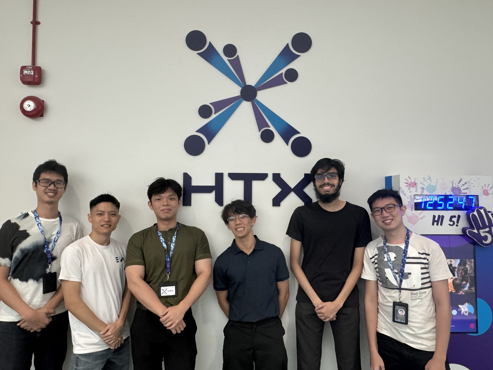

# Cyber AI Analyst Internship

**Home Team Science and Technology Agency (HTX), Q Team – Singapore** | *May 2024 - Aug 2024*
---
- Constructed automated data processing pipelines using Python and Selenium, extracting 10,000+ data points weekly for machine learning applications.
- Integrated OCR systems by combining multiple libraries (PyTesseract, EasyOCR) with facial recognition technologies to enhance document and identity processing.
- Built customised chat bots with LLaMA models through fine-tuning, enhancing internal knowledge retrieval and user interaction workflows.
